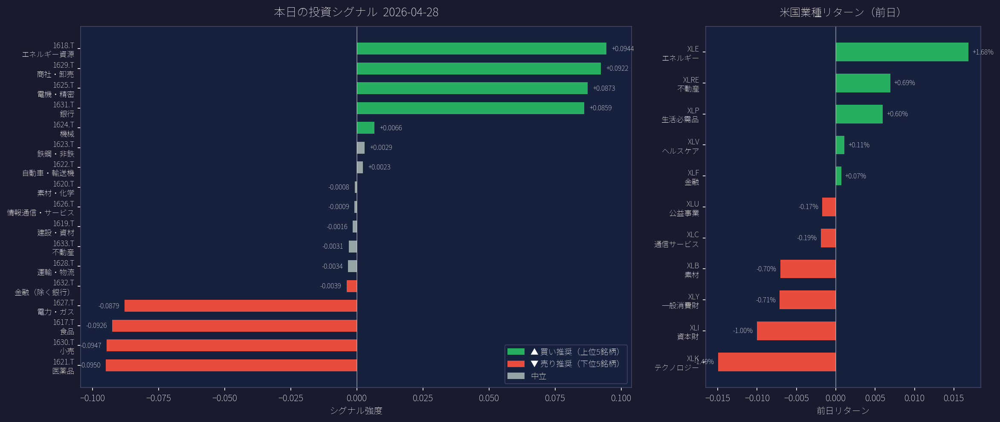

# 日米業種リードラグ投資戦略システム
**Lead-Lag Strategy for Japanese and U.S. Sector ETFs**

> このプロジェクトは以下の論文を基に、Claude (Anthropic AI) と共同で実装しました。  
> This project was implemented in collaboration with Claude (Anthropic AI), based on the paper below.

---

## 概要

米国市場（前日終値）→ 日本市場（翌朝始値）という **取引時間帯の非同期性** を利用した投資シグナルシステムです。

- 米国11業種ETFの終値リターンから、**翌日の日本17業種ETFリターンを予測**
- 部分空間正則化付きPCA（Subspace Regularization PCA）でシグナルを計算
- 毎朝 `main.py` を実行するだけで **買い推奨・売り推奨銘柄** がわかる

## ベースとなった論文

**中川慧, 竹本悠城, 久保健治, 加藤真大 (2026)**  
「部分空間正則化付き主成分分析を用いた日米業種リードラグ投資戦略」  
*人工知能学会 金融情報学研究会 SIG-FIN-036-13*

## 対象ETF

| 市場 | ティッカー |
|------|-----------|
| 米国（11銘柄） | XLB, XLC, XLE, XLF, XLI, XLK, XLP, XLRE, XLU, XLV, XLY |
| 日本（17銘柄） | 1617.T 〜 1633.T（NEXT FUNDS TOPIX-17業種別ETF） |

## 出力サンプル



- 緑バー：買い推奨（上位30%）
- 赤バー：売り推奨（下位30%）

## セットアップ

```bash
pip install yfinance pandas numpy matplotlib
```

## 使い方

VS Codeで `main.py` を開き、▷ ボタンを押すだけです。

```bash
python main.py
```

実行すると：
1. yfinanceで最新データを自動取得
2. シグナルランキングをターミナルに表示
3. `today_signal.png` としてグラフを保存

## ファイル構成

```
lead_lag_strategy/
├── main.py               # メイン実行ファイル（ここを実行）
├── data/
│   ├── fetch_data.py     # データ取得（yfinance）
│   └── preprocess.py     # リターン計算
├── strategy/
│   ├── subspace_pca.py   # 部分空間正則化PCA（論文ロジック）
│   └── portfolio.py      # ポートフォリオ構築
├── backtest/
│   └── backtest.py       # バックテスト
└── analysis/
    └── evaluate.py       # パフォーマンス評価・グラフ
```

## パラメータ

| パラメータ | 値 | 説明 |
|-----------|-----|------|
| L | 60 | ローリングウィンドウ（営業日） |
| K | 3 | 抽出ファクター数 |
| λ | 0.9 | 正則化強度 |
| q | 0.3 | ロング・ショート分位点 |

## 免責事項

本システムは研究・学習目的で作成されたものです。実際の投資判断は自己責任でお願いします。
